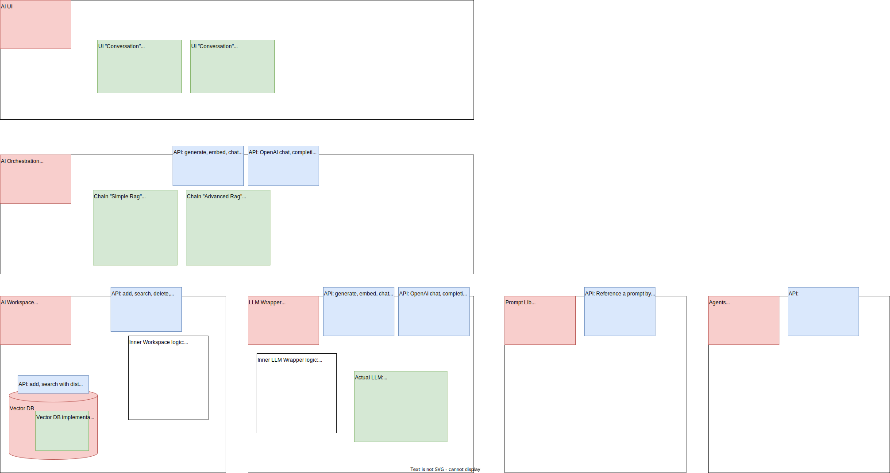
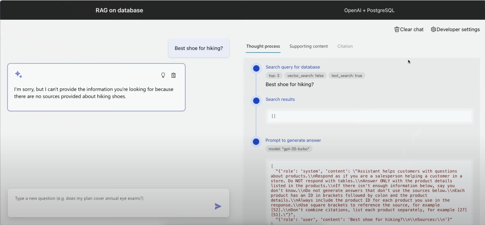

# ai-platform 🧠

An AI Platform that consist of basic, functional modules and that is prepared to tinker with it.




## Local Development

### Setting up & running

In order to install the server side:
* Make sure you are in the root directory of the project
* Create a local Python env: `python3.12 -m venv .venv`
* Activate it: `source .venv/bin/activate`
* Install the requirements: `pip install -r requirements.txt`

For the frontend:
```
cd src/ai_ui
npm install
```

Run the backend components:

```
# Orchestration
cd src
#python -m uvicorn ai_orchestration.main:app --reload
python -m ai_orchestration.main  

# AI Workspace
python -m ai_workspace.main
```

Run the AI-UI: 
```bash
cd src/ai_ui
npm run dev
```

Run tests:
* Make sure you are in the `src` directory
* `python -m pytest backend_tests --capture=no --log-cli-level=INFO`
  * Note: This is to also see the print and log statements.

### Running the tests

For the backend tests:
```bash
cd src

# Run the tests of one compnenent, for example ai_commons
python -m unittest discover ai_commons_tests

# Run all the unit tests
python -m unittest discover . 
```

For the UI tests:
```bash
cd src/ui
npm test
```

## The UI

The UI is inspired from [RAG on PostgreSQL - Github](https://github.com/Azure-Samples/rag-postgres-openai-python#) as explained in this video: [Building a RAG-powered AI chat app with Python and VS Code](https://www.youtube.com/watch?v=3ctFWU492xk&t=1177s).

An impression of what it looks like:



## The Brains

A brain is a Vectore Database (or a namespace within a vector DB) that contains documents / embeddings about a certain domain. It is typically attached to a loader that configures what data is to be loaded from where.

Loaders (planned and done):
* **Wikipedia** ✅: Given a start page on Wikipedia and a depth (i.e. how many links should the crawler go down), the wikipedia data is scraped and added to the brain.
* Confluence
* Email
* Discourse

Structure of a brain:
```json
{
  "Name": "Berlin Info",
  "DataPath": "/data/path/berlin",
  "EmbeddingModel": "all-MiniLM-L6-v2",
  "Loader":{                      
    "LoaderType": "wikipediaLoader",
    "StartingPage": "Berlin",
    "Depth": 3,
    "LastLoaded": "2024-06-27"
  },
  "NoOfDocs": 659,
  "NoOfChunks": 9471
}
```
**Notes**
* The Loader config is specific to the different loaders we have
* The `NoOfDocs` and `NoOfChunks` values are updated every time the brain info is questioned.

## Use cases

Use cases one could think of:

* Manual of software package or library: Add all the manual documents to a brain and question it.
* IT Assiatnt: Load all the confluence space of an IT organisation and assist based on that knowledge.
* Better writing assistant: Maybe even integrated into a Confluence plugin.

## Todo

* Data Loader for confluence pages and Emails
* API rukle: Every call should return a `ìnner_working` dictionary, For the ai_brain this could contain: Brain name, no of docs/chunks, search time, result size...
* Calling `python -m ai_brain` or similar should start the fastAPI server
* Make ability to load a brain with data, have it's configuration in a YAML file

## Resources

* A very nice overview on how to move on: [17 (Advanced) RAG Techniques to Turn Your LLM App Prototype into a Production-Ready Solution - Medium](https://towardsdatascience.com/17-advanced-rag-techniques-to-turn-your-rag-app-prototype-into-a-production-ready-solution-5a048e36cdc8)
* [Retrieval-Augmented Generation (RAG) from basics to advanced - Medium](https://medium.com/@tejpal.abhyuday/retrieval-augmented-generation-rag-from-basics-to-advanced-a2b068fd576c)
* [Advanced RAG 01: Small-to-Big Retrieval - Medium](https://towardsdatascience.com/advanced-rag-01-small-to-big-retrieval-172181b396d4)
* [Pydantic: Simplifying Data Validation in Python - Real Python](https://realpython.com/python-pydantic/)
* [Using FastAPI to Build Python Web APIs - Real Python](https://realpython.com/fastapi-python-web-apis/)
* [Embeddings and Vector Databases With ChromaDB - Real Python](https://realpython.com/chromadb-vector-database/)
* Original inspiration taken from [RAG on PostgreSQL - Github](https://github.com/Azure-Samples/rag-postgres-openai-python#) as explained in this video: [Building a RAG-powered AI chat app with Python and VS Code](https://www.youtube.com/watch?v=3ctFWU492xk&t=1177s)
